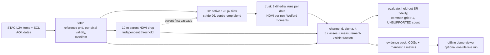

# TrustSR architecture and decision record (playbook pass 2)

Status: **Proposed**, 2026-09-29. Deciders: the team (human sign-off required on ADR-001 and ADR-002, which touch AGENTS.md).
Authority order is unchanged: [AGENTS.md](../../AGENTS.md) and the [NTRO statement](../problem_statement.md) define the task; [RISK_REPORT.md](../../RISK_REPORT.md) holds measured results; [playbook_strategy.md](../playbook_strategy.md) is the first playbook pass. This document adds new external research, one new synthetic probe, and five decisions. Nothing here is a measured pass for R1–R5, and no Phase 1 module is claimed.

## 1. What changed since the first playbook pass

| Finding | Source | Consequence |
| --- | --- | --- |
| The problem statement ID is **SIH26142** (NTRO, Space Technology). | Several public SIH 2026 repositories name it, e.g. [OrbitLens](https://github.com/AryaBadugu/OrbitLens-NTRO-SRM), [sih-26142](https://github.com/TIRUNARA/sih-26142-super-resolution-mapping). Not verified on sih.gov.in. | Put the ID on the title slide. Verify on the official portal before submission. |
| SIH 2026 grand finale: **December 2026**, 36-hour live build at nodal centres; finalist list expected around November. Exact date still unconfirmed. | [DTU internal-hackathon notice, 2026-08-28](https://www.dtu.ac.in/Web/upload/events/aug/file0807.pdf); [TechPathDaily timeline](https://techpathdaily.com/sih-2026-official-timeline-is-here/). | `docs/timeline.md` can now use D ≈ early December. If the playbook's "top 100" means Thapar's internal nomination, the **next gate is national screening of the idea deck and video**, which makes playbook p.11 (deck must work without you) the immediate deliverable. Confirm which stage the team is at. |
| At least five public repositories target SIH26142. They build: Swin2SR/BSRGAN or EDSR, MC-dropout uncertainty, FastAPI + React/Three.js dashboards, multi-model PSNR benchmarks; one reads "SRM" as sub-pixel land-cover mapping. | Repositories above plus [DEEPSRM-SIH26142](https://github.com/sanjai-k-oss/DEEPSRM-SIH26142), [sih-satellite](https://github.com/tWiLighT-xY91/sih-satellite), [rohithkumar505](https://github.com/rohithkumar505/SIH26142-Deep-Learning-Based-Super-Resolution-Mapping-SRM). | This is playbook p.13's "what will everyone else build". Nobody found so far gates a downstream decision on the original 10 m signal. The wedge holds; the dashboard is not a differentiator. |
| Theory now backs the trust gate. For decoders whose output is consistent with the low-resolution input, a hallucinated detail must be almost invisible in the measurement; whether a building is intact or damaged can be undecidable from Sentinel-2 alone. | Iagaru, Gottschling, Garnier, Hansen, [arXiv 2605.13146](https://arxiv.org/abs/2605.13146) (May 2026), Prop. 3.1 and §5.4 (Sentinel-2 ×4 experiments). | SEN2SR's Fourier hard constraint enforces low-frequency consistency. So a change that does not show at 10 m lies in the region where any consistent model may invent or erase it. The parent-pixel rule is the right test, not an ad-hoc heuristic. See ADR-003. |
| NRSC (ISRO) reported the Wayanad main scarp at about **86,000 m²** and a debris flow of about **8 km** along the Mundakkai river; post-event mapping used RISAT SAR the day after. | NRSC statements reported by [India TV](https://www.indiatvnews.com/news/india/wayanad-landslides-isro-releases-picture-of-86-000-square-meters-land-devastation-2024-08-02-944846) and [Asianet](https://newsable.asianetnews.com/india/wayanad-landslides-isro-s-satellite-image-show-extent-of-damage-crown-of-1550m-debris-travelled-8km-along-snt-shkvt4). | 86,000 m² = **860** Sentinel-2 10 m pixels = **13,760** pixels at 2.5 m. A scale sanity check for the Wayanad view, not ground truth (scarp ≠ vegetation-loss footprint). ISRO itself used radar because optical was clouded: that is the honest "why optical is late" line. |
| R2's own data shows partly clear post-event dates well before 6 December. | [r2_acquisitions.json](../../risk/results/r2_acquisitions.json): AOI cloud+shadow 76.4% (13 Aug), **57.5% (18 Aug)**, 85.4% (23 Aug), 76.5% (2 Sep), **43.4% (12 Sep)**, 43.7% (27 Oct). | The 129-day gap comes from an AOI-level 10% rule. TrustSR already classifies cloud per pixel as NO_DATA, so the right question is whether the *scar* was clear, not the whole 10 km square. See ADR-002. |

## 2. Playbook questions, answered with evidence

| Playbook | Answer for TrustSR | Evidence level |
| --- | --- | --- |
| p.4 Numbers in the PS | 10 m in, <4 m out, preserve geographic and spectral consistency, account for uncertainty. No cost, backlog or target accuracy is given. Do not invent one. | Supplied PS |
| p.7 Why does the problem still exist? | (1) Optical imagery is clouded when disasters happen (Wayanad: every acquisition from 19 Jun to 8 Aug was ≥99.95% cloud/shadow over the AOI). (2) Super-resolution is ill-posed: sub-pixel detail can be invented, and analysts cannot tell which parts are real, so they do not act on it. | R2 measured; arXiv 2605.13146 |
| p.9 What exists, what is missing | ESA's SEN2SR makes consistent ×4 SR; ESA's diffusion model gives sample uncertainty; competitors wrap generic SR in dashboards. Missing: a per-change label that says whether a change is visible in the original data. | Landscape + repo survey |
| p.10 Ministry | NTRO is a technical-intelligence agency whose remit includes satellite imagery. In imagery intelligence an invented structure is a false report. Frame TrustSR as "fewer false reports", and make it run offline with open weights. This is framing, not a claim about individual jurors. | [NTRO overview](https://en.wikipedia.org/wiki/National_Technical_Research_Organisation) |
| p.13 Wedge | SR plus a gate that refuses to report a change the 10 m data cannot support, and counts what it refused. | Design; unmeasured until calibration |
| p.14 Why now | Pinned open SR models with explicit spectral constraints (SEN2SR, 2025); free L2A COGs with SCL masks via STAC; 2025–26 theory that tells you *which* SR details are decidable. | Sources above |
| p.15 Ten-second moment | Dated 10 m before/after → 2.5 m → overlay: red OBSERVED, amber INFERRED, grey NO_DATA, and a counter "N SR-only changes suppressed". | Storyboard until built |
| p.16 Attack the risk | Order in §5. The killers are tile policy, real fine-tuning, the post-date story and calibration labels, in that order of cheapness to test. | RISK_REPORT |
| p.17 Compound | Reusable asset: an audited SR/change contract (exact-grid COGs, provenance, NO_DATA/UNSUPPORTED counts, tests). It transfers to any future EO hackathon. | Repo |

## 3. System architecture

The module contracts in [project_blueprint.md](../project_blueprint.md) stand. This document changes four things: the tiler geometry (ADR-001), how dates are selected (ADR-002), one added diagnostic (ADR-003), and the delivery shape at the finale (ADR-004).

Compute budget from measured latency. R1 measured 0.1208 s per native tile on the RTX 4050. A 1000 × 1000 px (10 × 10 km) AOI at stride 96 needs 11 × 11 = 121 tiles; eight dihedral runs make 968 forward passes, about **2 minutes per date**. Thirteen dates (12 pre + 1 post) take about **25 minutes** of GPU time, excluding I/O and blending. This is an estimate from a synthetic-input benchmark, not a measured end-to-end run. It says the full ensemble is feasible offline, and that the finale live run should be one tile or a parent-first subset.

---

## ADR-001: Tile policy — native 128 px tiles with overlap; retire the 64 px OOM fallback

**Status:** Proposed — **needs a human decision** (changes AGENTS.md).

### Context
The pinned `HardConstraint` multiplies by a stored 512 × 512 frequency mask, so only 128 px inputs work (R1: 64 and 512 fail). AGENTS.md requires halving the tile on CUDA OOM down to 64 px. R1 measured **128 MiB reserved** at 128 px, batch 1: 3.1% of the 4 GiB budget. Upstream source ([tricks.py](https://github.com/ESAOpenSR/SEN2SR/blob/8e21bb669bcc6e8eb953a1fb24dfc5bb59dc18a4/sen2sr/models/tricks.py)) shows how such masks are built: one of four families (ideal, Butterworth, Gaussian, sigmoid) with radius `min(h/2, w/2) // scale`, which is 64 for a 512 output. The loaded mask's family has not been identified; HF downloads were blocked in this session.

The constraint is a global FFT on each tile, so it treats the tile as periodic. The synthetic probe [experiments/probes/fft_edge_probe.py](../../experiments/probes/fft_edge_probe.py) re-implements that math in NumPy and compares two tile grids offset by half a tile (synthetic scene, not the pinned weights):

| Distance from tile edge (2.5 m px) | Ideal mask, p99 \|Δ\| between grids | Gaussian mask, p99 \|Δ\| |
| --- | --- | --- |
| 0–8 | 0.142 | 0.130 |
| 8–16 | 0.055 | 0.011 |
| 16–32 | 0.040 | 0.001 |
| 32–64 | 0.030 | 0.000 |
| 64–128 | 0.025 | 0.000 |

(Signal σ ≈ 1.05.) With a smooth mask the boundary effect is gone by about 32 output px (8 input px). With an ideal mask its long sinc tails never fully vanish, but cropping 16 input px per side cuts the error about fivefold. The network's own convolutional receptive field adds edge effects not measured here.

### Options

| | A: regenerate a 256×256 mask for 64 px | B: pad 64 → 128 | C: native 128 only; on OOM reduce batch, then fail |
| --- | --- | --- | --- |
| Complexity | Medium: identify family and parameters, prove the regenerated 512 mask equals the stored one | Low | Low |
| Fidelity | Faithful only if the family is recovered exactly | Unchanged | Unchanged |
| Memory benefit | Real but unneeded at 3% of budget | None (same tensor size) | n/a |
| Risk | A near-match mask silently changes spectral behaviour | Disguises a non-solution as a fallback | An OOM at 128 px/batch 1 fails loudly |

### Decision
Adopt **C**. The tiler uses only 128 × 128 model inputs, stride from config (default 96), centre-crop blending that discards at least 16 input px per side except at scene edges, tiles anchored to the reference-grid origin, and edge tiles clamped. On CUDA OOM: reduce batch size to 1, free cache, retry once; then fail with a message naming the tile and memory counters. Run A as a cheap diagnostic only: if the stored mask is exactly reproducible (for example, binary values match `ideal_filter((512,512), 64)`), record that 64 px support is *possible*, but do not enable it unless memory ever requires it.

The first step of experiment E1 is to load `hard_constraint.safetensor` and report its unique values, radial profile and best-matching family. That result sets the stride: a smooth mask allows stride 112, an ideal mask keeps 96.

### Consequences
Easier: one code path, simpler tests, no fake fallback. Harder: the 4 GiB claim rests on the allocator-cap measurement (E4), not on a physical 4 GB card; say so. Revisit if batch > 1 or a larger model is adopted.

**AGENTS.md lines a human would change** (do not edit without sign-off):
- "Every GPU step must run on 4 GB with tiling; add automatic tile-size reduction on CUDA OOM." → "...with tiling at the model's native 128 px input; on CUDA OOM reduce batch size, then fail with a message."
- "CUDA OOM → halve the tile size and retry, down to 64 px; then fail with a message." → "CUDA OOM → retry once at batch 1 after freeing cache; then fail naming the tile and memory counters. 64 px is not supported by the pinned Fourier constraint (R1)."

---

## ADR-002: Choose the post-event date by per-pixel validity over the change footprint

**Status:** Proposed — needs a human decision (changes the R2 clear-date rule used by `fetch`).

### Context
The configured rule requires ≤10% cloud+shadow over the whole 10 km AOI. It selected 6 December 2024, 129 days after the event, which forces the "retrospective only" disclaimer. But TrustSR already marks cloud per pixel as NO_DATA. The landslide scar is a narrow corridor in a 100 km² square. Several earlier dates were partly clear at AOI level (18 Aug: 57.5% cloud/shadow; 12 Sep: 43.4%). Whether the scar itself was visible on those dates is **unknown**: R2 did not store per-pixel SCL.

Seasonal confounding is the other half. The accepted pre-dates are January–May (dry season); any post-date from August to December is monsoon or post-monsoon. Same-season dates from 2023 would be a better baseline for vegetation loss.

### Options
- **A. Keep AOI-level 10%.** Simple and already audited. Cost: 129-day gap, strongest confounding.
- **B. Footprint-level validity.** Build the change-candidate footprint once from 10 m data (parent-positive pixels of the January-2024-vs-6-December comparison, dilated by a buffer), then pick the earliest post-date whose valid coverage *inside that footprint* passes a configured threshold. Also publish a per-pixel "first clear observation" date raster.
- **C. Per-pixel best-available compositing.** Each pixel takes its earliest clear post-date. Highest coverage, but mixes dates inside one change map and complicates σ and date labelling.

### Decision
Adopt **B**, keep A as the documented fallback, reject C for the demo (it can be a later research view). Add season-matched pre-dates from the same months of 2023 as a second baseline and report both. Using the 6 December comparison to define the footprint is only for date selection; it must not feed labels or calibration.

### Consequences
If a scar-clear August or September date exists, the showcase gap shrinks from 129 days to a few weeks, and the pitch can move from "retrospective only" toward "first clear optical view of the scar". If none exists, the negative result is itself a slide: optical SR cannot beat monsoon cloud, which is why NRSC used SAR. Either outcome is reportable. The rule must be fixed in config before looking at dates (experiment E9).

---

## ADR-003: Ground the trust gate in measurement consistency; add one continuous diagnostic

**Status:** Proposed.

### Context
The five classes are the product's core and stay unchanged. Reviewers will ask why the 10 m parent is the right referee. The theory in arXiv 2605.13146 answers it: for a consistent decoder, any hallucinated detail must be nearly invisible after downsampling. A change that is visible at 10 m is constrained by the data; a change that is not visible can be invented or erased by *any* consistent model.

### Decision
Keep the class rule. For every connected change object (and every parent pixel) also report the **measurement-visible fraction**

ρ = ‖P Δ‖² / ‖Δ‖², where Δ is the 2.5 m NDVI-drop field on the object and P replaces each 4 × 4 block by its mean.

P is an orthogonal projection, so ρ lies in [0, 1]. ρ near 1 means the change is block-constant, fully visible at 10 m. ρ near 0 means it is pure sub-pixel pattern, the part SR is free to invent. It is cheap, needs no labels, and makes the INFERRED class explainable ("the parent changed, but 80% of this outline's energy is sub-pixel"). It is a diagnostic in reports and the demo tooltip, **not** a sixth class (playbook p.5: three features that land). Area averaging only approximates the Sentinel-2 point-spread function; state that.

### Consequences
The pitch gets one defensible sentence: "We show where SR is allowed to guess, and we never count a guess as damage." Risk: ρ can be misread as a probability. Label it as a fraction of signal energy.

---

## ADR-004: Finale delivery — offline evidence pack plus one bounded live tile

**Status:** Proposed.

### Context
The finale is a 36-hour, on-site build; venue network and GPU access are unknown. The full Wayanad ensemble needs about 25 GPU-minutes (estimate above). Competitors will demo dashboards.

### Decision
Before the finale, freeze an **evidence pack**: aligned 10 m COGs, 2.5 m SR COGs, class COGs, ρ and UNSUPPORTED counts, `manifest.json` (item IDs, dates, SCL policy, model and checkpoint hashes, config hash) and `metrics.json`. The viewer (Streamlit, per AGENTS.md) reads only from the pack and works with networking off. The live button runs one 128 px tile end to end on the local GPU, capped in time, with a visible "live" label. Use the 36 hours for things that improve the argument: calibration on a held-out event, the second baseline, a second showcase site if data allows. Do not rebuild the pipeline on site.

### Consequences
The jury sees the same numbers whether or not the network works. Precomputed views are labelled as precomputed. Risk: judges may want "any location". Answer: show the live tile, then explain the date and cloud audit that any new AOI must pass.

---

## ADR-005: Scope of "Super-Resolution Mapping"

**Status:** Proposed.

### Context
In remote sensing, "super-resolution mapping" (SRM) often means sub-pixel *land-cover* mapping, and at least one competing team reads the PS that way. The PS body asks for a sharper image with uncertainty handling and downstream use.

### Decision
Deliver both readings without widening scope: the 2.5 m SR image **and** a 2.5 m class map (the five trust classes) with provenance. Name the class map "super-resolution change map" in the deck. Do not add a land-cover classifier.

### Consequences
Covers a likely jury question in one slide. No new model.

---

## 4. Evaluation contract additions

- Report the Wayanad OBSERVED and OBSERVED∪INFERRED areas next to the NRSC 86,000 m² scarp and 8 km flow length, as a **scale check**. State that the definitions differ and that the NRSC figure is not a TrustSR label.
- Keep the two honest baselines from [landscape.md](../landscape.md): 10 m change rule and bicubic 2.5 m. Add "ungated 2.5 m SR" so UNSUPPORTED suppression is visible as a number.
- For the seam test (E2), set tolerances from the E1 mask-family result, not before it.

## 5. Work order by risk (playbook p.16)

| # | Killer risk | Smallest test | Needs | Unblocks |
| --- | --- | --- | --- | --- |
| 1 | Tiles do not stitch faithfully | E1 step 0: identify mask family; then tiler + E2 seam numbers | Pinned weights (local cache), CPU | sr, trust, all GPU experiments |
| 2 | Fine-tuning does not run on real pairs | R5 in Colab with the three prepared AOIs | Colab sign-in, staged pairs | fine-tuned checkpoint |
| 3 | Demo date is too late to matter | E9 footprint-level SCL audit, plus 2023 same-season pre-dates | Planetary Computer access | pitch framing (ADR-002) |
| 4 | No labels to calibrate k | Inspect GLaD4CD members, licence, mask meaning | ~2 GB download | honest F1 |
| 5 | Memory claim | E4 allocator-capped full-AOI run | Local GPU | 4 GiB statement |

Then Phase 1 increments as in the blueprint. Experiments E1–E8 are specified in the project's six-laws prompt; E9 and the E1 step 0 are added in [agent brief addendum](../agent_briefs/six_laws_addendum.md).

## 6. Open questions for the team

1. Is the team a **national finalist**, or nominated by Thapar and awaiting national screening? This decides whether the next deliverable is the idea deck/video or the finale build.
2. Sign-off on ADR-001 (drop 64 px fallback) and ADR-002 (footprint-level date rule).
3. Confirmed finale date and nodal centre, to replace the relative timeline.
4. The six-laws prompt says "For E4 and 6A". This is read as E4 and E6; confirm.
