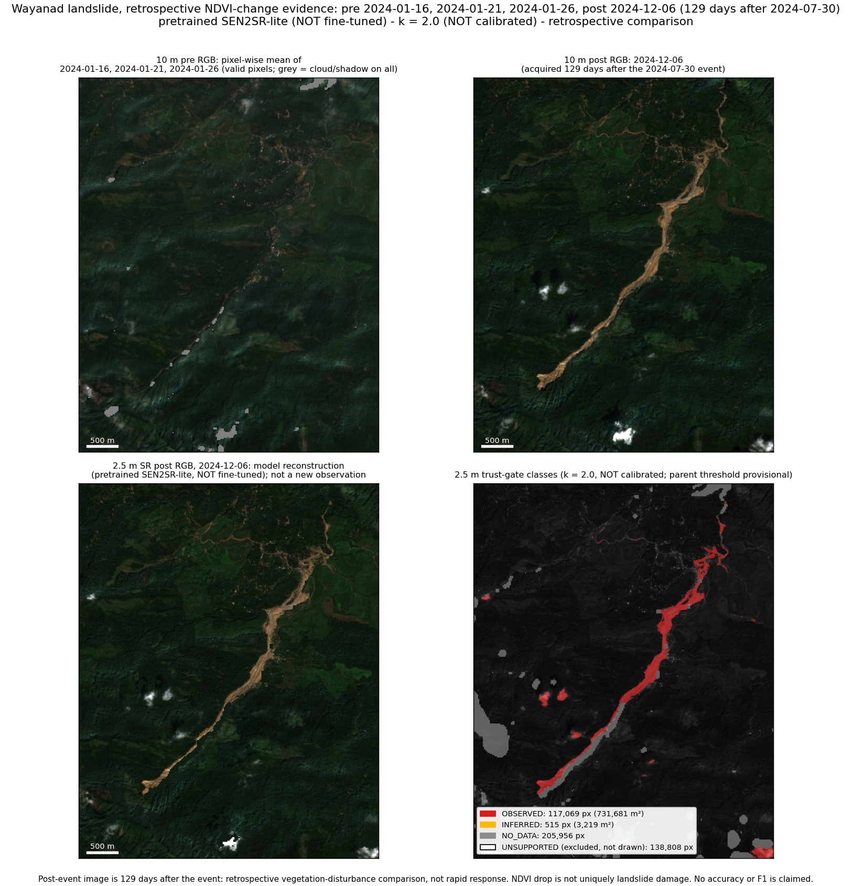

# Wayanad evidence: NDVI change with a trust gate

**Labels (apply to every number and image here):** pretrained SEN2SR-lite (NOT fine-tuned) · k = 2.0 (NOT calibrated) · retrospective comparison.
Pre-event acquisitions 2024-01-16, 2024-01-21, 2024-01-26; post-event acquisition **2024-12-06**, **129 days** after the 2024-07-30 event.
Parent-drop threshold 0.3: **provisional, set before viewing data**, not calibrated. Bands B02/B03/B04/B08 only; SCL is a validity mask only.

**AOI correction.** The AOI in `RISK_REPORT.md` (11.782N, 76.233E) is about 34 km north of the slide. This run uses a 10,240 m square centred on
11.49N, 76.16E (chosen from published place coordinates, never from imagery), so every date and item ID differs from
`risk/results/r2_acquisitions.json`. The largest parent-positive component lies within 1500 m of every published coordinate:
crown 6 m, mundakkai 112 m, chooralmala_bridge 8 m.
The brief's dates failed the AOI clear rule (cloud+shadow ≤ 10 %) on this AOI and were replaced per the pre-set config rule: 2024-01-11 (39.1 %) → 2024-01-16 (2.8 %); 2024-01-31 (11.4 %) → 2024-01-26 (3.4 %).



## Numbers

| Quantity | Value | Unit | Denominator / basis | Source |
|---|---|---|---|---|
| 10 m parent area, AOI | 1,807,500 | m² | 104,857,600 m² AOI (1024x1024 px @10 m) | `outputs/step1.json` |
| 10 m parent area, largest component | 553,900 | m² | parent-positive pixels, 8-connected | `outputs/step1.json` |
| 10 m parent area, inside 2.5 m crop | 734,900 | m² | crop [640, 512] px @10 m | `outputs/step4.json` |
| Footprint (largest component + buffer) | 3,901,900 | m² | buffer 200 m; date selection only | `outputs/step1.json` |
| OBSERVED | 117,069 px = 731,681 | px = m² | 5,036,924 valid 2.5 m px | `outputs/step4.json` |
|   of which OBSERVED inside the largest parent component | 88,335 px = 552,094 | px = m² | 117,069 OBSERVED px | `outputs/step4.json` |
|   of which OBSERVED elsewhere in the crop (not scar) | 28,734 px = 179,588 | px = m² | 117,069 OBSERVED px | `outputs/step4.json` |
| INFERRED | 515 px = 3,219 | px = m² | 5,036,924 valid 2.5 m px | `outputs/step4.json` |
| OBSERVED ∪ INFERRED | 734,900 | m² | equals the parent area on valid pixels | `outputs/step4.json` |
| UNSUPPORTED (SR-only, suppressed by the gate) | 138,808 | px | of 255,877 ungated S pixels | `outputs/step4.json` |
| Ungated SR positives S = d > kσ | 255,877 px = 1,599,231 | px = m² | 5,036,924 valid 2.5 m px | `outputs/step4.json` |
| NO_DATA (cloud/shadow/invalid/NDVI undefined) | 205,956 | px | 5,242,880 crop px @2.5 m | `outputs/step4.json` |
| NRSC main scarp (scale check ONLY, not a label) | 86,000 | m² | different definition and data | `configs/wayanad_evidence.yaml` |
| ρ median, S-objects ≥ 16 px | 0.644 | fraction of energy | 637 objects | `outputs/step4.json` |
| ρ p10 / p90, S-objects ≥ 16 px | 0.441 / 0.843 | fraction of energy | 637 objects | `outputs/step4.json` |
| ρ energy-weighted mean, all S-objects | 0.978 | fraction of energy | 2217 objects | `outputs/step4.json` |
| ρ median, majority-UNSUPPORTED objects | 0.321 | fraction of energy | 2212 objects | `outputs/step4.json` |
| SR drop d, median at UNSUPPORTED pixels | 0.109 | NDVI units | 138,808 UNSUPPORTED px | `outputs/step4.json` |
| 10 m parent drop, median at UNSUPPORTED pixels | 0.103 | NDVI units | threshold 0.3 | `outputs/step4.json` |
| UNSUPPORTED px with 10 m drop > 0.05 | 75.0 | % | 138,808 UNSUPPORTED px | `outputs/step4.json` |
| Post-event gap | 129 | days | event 2024-07-30 to post date | `outputs/step1.json` |
| Total SR wall time (8 runs, all tiles, 4 dates) | 44 | s | 1120 forward passes on cpu | `outputs/step3.json` |
| Median time per tile (8 dihedral runs) | 0.31 | s | 35 tiles per date | `outputs/step3_tile_log.json` |
| Peak process RSS (CPU proxy) | 2320 | MiB | NOT GPU memory | `outputs/step3.json` |
| GPU peak allocated/reserved | BLOCKED | - | no CUDA device on the run machine | `outputs/step3.json` |

The NRSC figure sits beside these only for scale. TrustSR areas are NDVI-drop pixels (scarp plus runout vegetation loss, on a
10 m parent rule); NRSC maps the main scarp from other data with another definition. NRSC is not a label and no agreement is claimed.

**OBSERVED is not scar area.** Of the 117,069 OBSERVED pixels, 88,335 lie inside the largest 10 m parent component
and 28,734 elsewhere in the crop (3 SCL classes there in the post image: vegetation 31 %, bare soil 69 %, unclassified 0 %).
There is no SCL cloud class in this crop on the post date, so these patches are not masked-cloud residue; they are mostly pixels SCL calls bare soil or
vegetation, 61 % lie within 150 m of pixels SCL flags dark/shadow (a random crop pixel: 22 %).
Whether they are other clearings, terrain shading or something else was **not established**; the parent rule cannot tell them from vegetation loss.
Conversely, 18 % of the pixels in a 30 m ring around the main component are SCL-invalid on the post date, all of them class 2 (dark area),
which is why grey NO_DATA strips run along parts of the scar margin. That is SCL-mask quality, not gate behaviour, and it was not corrected here.

**Reading UNSUPPORTED correctly.** S = d > kσ has no absolute floor (median σ here 0.033, so kσ ≈ 0.07), while P needs a 10 m drop above 0.3.
The 138,808 UNSUPPORTED pixels are therefore mostly *modest, real* NDVI decreases that the 10 m data also show but below the parent threshold:
their SR drop has median 0.109 against a 10 m drop of median 0.103,
and 98.5 % of them have a positive 10 m drop. The gate suppresses them as change, as designed,
but this count is **not a count of invented detail**, and it depends on the provisional parent threshold and on k.

ρ = ‖PΔ‖²/‖Δ‖² per connected S-object (P = 4×4 block mean): a fraction of signal energy, not a probability. Objects smaller than one 10 m block
(16 px) are excluded from the main distribution; all 2217 objects are in `outputs/rho_objects.csv`.

### Spectral consistency (mean |area-mean 4×4 downsample of SR − 10 m input| reflectance, identity run, valid pixels)

| Date | B04 | B03 | B02 | B08 | 10 m valid px |
|---|---|---|---|---|---|
| 2024-01-16 | 0.0004 | 0.0004 | 0.0004 | 0.0022 | 323,116 |
| 2024-01-21 | 0.0004 | 0.0005 | 0.0005 | 0.0027 | 320,908 |
| 2024-01-26 | 0.0004 | 0.0005 | 0.0004 | 0.0027 | 324,620 |
| 2024-12-06 | 0.0005 | 0.0006 | 0.0005 | 0.0029 | 320,612 |

Reported against a tolerance of 0.02 (set in config, not tuned). The pretrained constraint mixes the *bicubic*-upsampled
input into low frequencies, so a nonzero downsample error is expected and is not a fidelity score.

## Step 2: was the scar visible before 2024-12-06? (ADR-002, report only)

Candidates: every acquisition after the event and before the chosen post date with AOI cloud+shadow < 100 % on **this** AOI (re-derived from its own audit, so the list differs from the one in the brief, which came from the old AOI). Threshold: ≥ 90 % of footprint pixels SCL-valid.

| Date | Days after event | AOI cloud+shadow % | Footprint valid % | Valid / footprint px | Passes |
|---|---|---|---|---|---|
| 2024-08-13 | 14 | 70.2 | 11.7 | 4,557 / 39,019 | no |
| 2024-08-18 | 19 | 74.8 | 0.5 | 180 / 39,019 | no |
| 2024-08-23 | 24 | 85.7 | 15.0 | 5,837 / 39,019 | no |
| 2024-08-28 | 29 | 100.0 | 0.0 | 0 / 39,019 | no |
| 2024-09-02 | 34 | 98.3 | 0.2 | 88 / 39,019 | no |
| 2024-09-12 | 44 | 95.8 | 8.4 | 3,273 / 39,019 | no |
| 2024-09-22 | 54 | 80.5 | 1.5 | 567 / 39,019 | no |
| 2024-09-27 | 59 | 100.0 | 0.0 | 0 / 39,019 | no |
| 2024-10-02 | 64 | 95.6 | 0.5 | 196 / 39,019 | no |
| 2024-10-17 | 79 | 99.6 | 0.3 | 116 / 39,019 | no |
| 2024-10-27 | 89 | 42.3 | 72.5 | 28,287 / 39,019 | no |
| 2024-11-01 | 94 | 59.9 | 43.5 | 16,980 / 39,019 | no |
| 2024-11-06 | 99 | 34.5 | 46.5 | 18,154 / 39,019 | no |
| 2024-11-11 | 104 | 86.8 | 2.4 | 935 / 39,019 | no |
| 2024-11-16 | 109 | 88.7 | 9.9 | 3,856 / 39,019 | no |
| 2024-11-21 | 114 | 99.5 | 0.0 | 0 / 39,019 | no |

Earliest passing date: **none passes the threshold**.
The post date of this run was not switched. The footprint is used for date selection only, never as a label; SCL validity is a model estimate and does not mean haze-free.

## Step 3a: the pinned Fourier mask

Shape [512, 512], float32, 22026 unique values (min 5.831456237759119e-24, max 1.0); centre 1.0, corner 5.831456237759119e-24.
Upstream families built at radius 64 (the `tricks.py` default for a 512 px output, ×4): best match **sigmoid** with max |diff| 0.312, i.e. **no family at radius 64 reproduces the stored mask** (within 1e-6: False); binary: False → classified **smooth**.
Diagnostic (not an upstream setting): a Gaussian with free σ matches the stored mask with max |diff| 6e-08 at **σ = 35.000 px**, so the pinned mask is a Gaussian low-pass of σ ≈ 35 rather than the σ = 64 of the default family. Whether a 256×256 version for 64 px inputs could be regenerated (σ would have to be rescaled with the FFT size) was not tested, and 64 px inputs are not enabled (ADR-001).
Stride used: 96 with a 16 px centre-crop margin. stride 112 would need an 8 px centre-crop margin, contradicting the >= 16 px rule; stride 96 with a 16 px margin is used whichever family fits.
Real-model seam probe (two tile grids offset by 64 input px, real weights, real imagery; p99 |Δ| by 2.5 m px from the tile edge): 0-8px_HR: p99 0.02011 | 8-16px_HR: p99 0.00532 | 16-32px_HR: p99 0.004384 | 32-64px_HR: p99 0.004894 | 64-129px_HR: p99 0.006029.
Synthetic probe for comparison: `0001-docs-architecture-decisions-from-playbook-pass-2-ADR.patch (patch content; the JSON file itself is not on this branch)`. Different inputs and signal scales, so compare the decay, not absolute values: edge-to-interior p99 ratio: real model 3.3; synthetic probe, ideal mask 5.7, Gaussian mask 9.4e+05.
The real model's far-from-edge p99 stays at about 0.00603, whereas the synthetic Gaussian-mask probe predicts essentially zero there. So a disagreement floor between the two tile grids exists beyond what the Fourier constraint alone explains. The network's own convolutional context is the likely contributor, but this measurement did not isolate it.
Upstream `gaussian_filter` and `sigmoid_filter` raise `TypeError` in the pinned package, so the families were re-implemented from their source formulas (test-checked).

## Runtime and memory

Device **cpu** (CUDA available: False). 35 native 128 px tiles per date at stride 96, 8 dihedral runs each, 4 dates
= 1120 forward passes; median 0.31 s per tile (8 runs), total 44 s.
Peak process RSS 2320 MiB (CPU proxy). **GPU peak memory and GPU latency: BLOCKED**, no CUDA device here; the only GPU evidence is R1 (synthetic input, RTX 4050).
Determinism: seed 2024, `torch.use_deterministic_algorithms(True)`, fixed tile order; a tile re-run was byte-identical: True (macOS-arm64 CPU only).
Network: 60,942,522 bytes received in the fetch run (per-process counter, cap 300,000,000; the whole-year SCL audit and the four dates' bands; log `outputs/step1_fetch_log.txt`). The step 1 re-run read from cache and received 1,145,373 bytes (STAC search only).

## What this does not show

- **No accuracy, precision, recall or F1.** No labels were used or compared against; NRSC is a scale check only.
- **No calibrated k and no calibrated parent threshold.** k = 2.0 and the threshold 0.3 are configured defaults fixed before viewing data.
- **No fine-tuning.** Weights are the pretrained SEN2SR-lite; R5 (fine-tune) has not run.
- **No 2.5 m ground truth.** SR output is a model reconstruction; UNSUPPORTED/INFERRED describe measurement support, not truth.
- **No physical 4 GB test.** No CUDA device was available; no GPU memory number exists for this run.
- **No building- or road-damage claim.** NDVI drop is vegetation disturbance, not uniquely landslide damage.
- **Seasonal/recovery confounding.** January (dry-season) pre dates against a 2024-12-06 post date; the post-monsoon vegetation is not the same season, and 129 days of recovery/clearing sit between the event and the image.
- **Reflectance scaling.** ESA baseline convention (DN−1000)/10000 was applied; the SEN2SR training-data scaling was not verified against the model card.
- **Circular footprint.** The footprint comes from the same NDVI comparison and is used only for date selection and cropping.

## Reproduce

```bash
.venv/bin/python -m experiments.wayanad_evidence.step1_baseline   # audit, fetch, baseline (network)
.venv/bin/python -m experiments.wayanad_evidence.step2_visibility
.venv/bin/python -m experiments.wayanad_evidence.step3_sr
.venv/bin/python -m experiments.wayanad_evidence.step4_gate
.venv/bin/python -m experiments.wayanad_evidence.step5_report
```
Config hash `929bacb36d2cb1a935707b7622675bd042b830aacf124d201f0f1a6a3e7d2d08`. Large COGs (`stack_*.tif`, `sr_*.tif`) are regenerated locally and not committed.
